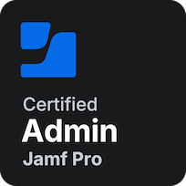
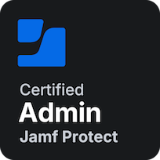
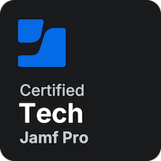
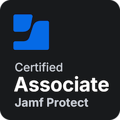
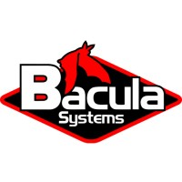

# ~$ whoami

Hey, I’m Matt a Systems Administrator with a strong focus on macOS, Linux, and the Apple ecosystem.

I love designing and operating infrastructure with an emphasis on GitOps and Infrastructure as Code, aiming to make systems simple and reproducible. I enjoy building environments where change is deliberate, versioned, and recoverable by default.

My day to day interests sit at the intersection of macOS administration, Linux systems, and storage. Whether it’s managing Apple fleets with Jamf, automating Linux infrastructure, or designing reliable storage systems, I’m happiest when everything is documented in code and quietly doing its job in the background.

I’m particularly passionate about:

- Infrastructure as Code & GitOps – Treating infrastructure like software.
- macOS & Apple Ecosystem Administration – Jamf, MDM, configuration profiles, and macOS automation.
- Linux Systems & Storage – Servers, filesystems, and building dependable foundations.
- Automation & Configuration Management – SaltStack, Ansible, and removing manual work wherever possible. Automate all of the things!

## Skills

### Apple & macOS Administration

### Linux, Storage, Backup and Services

### Automation, IaC & GitOps

### Virtualisation & Testing

### Networking

## Certifications

### Jamf

### Bacula

 Bacula Admin 1 Issued Jun 2023 Credential ID 3EFE46A6

### Apple

 Apple Certified Associate - Mac Integration 10.12 Issued Nov 2017

## Open Source Projects

- [Automating a NAS with SaltStack](https://github.com/mrbrown89/son-of-anton) – Example of how to build a ZFS based NAS using Salt.
- [Salting macOS](https://github.com/mrbrown89/salting-macOS) - Example files on using SaltStack to manage your mac. Include CI examples.

## Articles

- [A Brief Look at Apple’s Gatekeeper](articles/Apple-Gatekeeper.md)
- [Managing a Studio with Salt](articles/Managing-a-Studio-with-Salt.md)
- [Put the Kettle on. Let's Have a Brew](articles/Put-the-kettle-on-lets-have-a-brew.md)
- [What Remains in the Aftermath](articles/What-Remains-in-the-Aftermath.md)
- [Salting GitOps. Managing a NAS with Salt and GitOps](articles/Managing-a-NAS-with-Salt-and-GitOps.md)
- [A Brief Look at Apple’s Gatekeeper](articles/Apple-Gatekeeper.md)

## Contact

