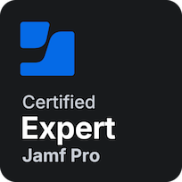
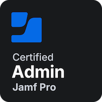
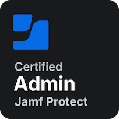
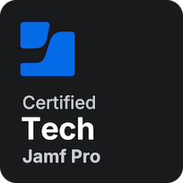
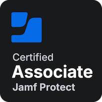
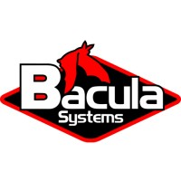

# ~$ whoami

Hello, World! I’m Matt.

I’m a macOS and linux nerd who loves building simple, repeatable systems using IaC and GitOps.

I’m happiest in the terminal writing scripts, testing workflows in Tart VMs, and using tools like Salt, Ansible, Terraform and Jamf to manage Macs the same way we manage code. I also love building NAS systems in linux all managed with IaC.

I like to keep things simple:

- Build it once
- Make it reproducible
- Avoid tool sprawl
- Get the most out of the tools you already have

I’m always experimenting with new ideas and better ways of working, and I share what I learn as open source repos usually with lab-style demos you can spin up and play with. I've also written a few articles which are hosted on GitHub.

## Open Source Projects

- [Terraforming Jamf](https://github.com/mrbrown89/terraforming-jamf) - Example guide of managing Jamf Pro and Jamf Protect with Terraform.
- [Automating a NAS with SaltStack](https://github.com/mrbrown89/son-of-anton) – Example of how to build a ZFS based NAS using Salt.
- [Salty Fleet](https://github.com/mrbrown89/saltyFleet) - Example repo showing how to spin up a Fleet DM container and a Munki repo along with packer files to spin up a mac VM, enrol it in Fleet and manage the VM using Salt. 

## Articles

- [Cheffin' IT](articles/Cheffin-IT.md)
- [A Brief Look at Apple’s Gatekeeper](articles/Apple-Gatekeeper.md)
- [Managing a Studio with Salt](articles/Managing-a-Studio-with-Salt.md)
- [Put the Kettle on. Let's Have a Brew](articles/Put-the-kettle-on-lets-have-a-brew.md)
- [What Remains in the Aftermath](articles/What-Remains-in-the-Aftermath.md)
- [Salting GitOps. Managing a NAS with Salt and GitOps](articles/Managing-a-NAS-with-Salt-and-GitOps.md)
- [A Brief Look at Apple’s Gatekeeper](articles/Apple-Gatekeeper.md)

## Certifications

### Jamf

### Bacula

 

Bacula Admin 1 Issued Jun 2023 Credential ID 3EFE46A6

### Apple

 

Apple Certified Associate - Mac Integration 10.12 Issued Nov 2017

## Contact

